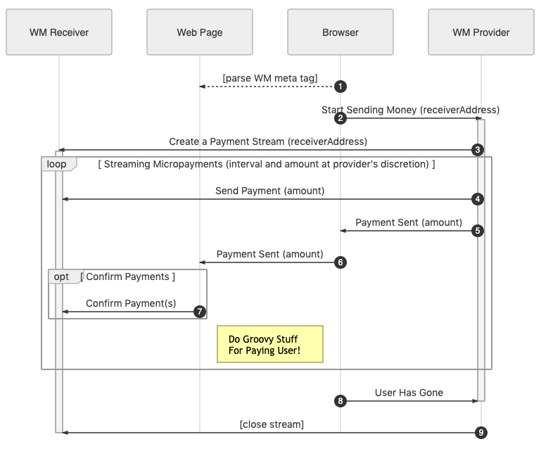

# Web Monetization Explainer

Web Monetization is a proposed API standard that allows websites to request a stream of very small payments from a user e.g. fractions of a cent. 

This provides a framework for new revenue models for websites and web-based services, as an alternative to subscription services or advertising, while preserving the user's privacy.

In exchange for payments from the user websites can provide the user with a "premium" experience such as exclusive content or by removing advertising or even the need to login to access content or services.

[Skip straight to code...](#handle-payments)

## Goals

Provide websites with a way to collect multiple small payments from users in exchange for consuming the content and/or services on the website.

The experience must be frictionless for users. It must allow users to pre-approve payments in aggregate or delegate the authorization of the individual small payments to a third-party (a Web Monetization provider) that interacts with the website without the need for user interaction.

This system must preserve the user's privacy. It must not be possible for websites to identify users on the basis of the payments they make. It must not be possible for the user's Web Monetization provider to get details of a user's browsing history.

## Non-goals

Online purchases. Web Monetization is intended to enable very small payments. This distinction is important because very small payments can be performed with different levels of user consent to larger payments such as those used in traditional e-commerce. 


## Overview of the Flow



### Actors

 - **Web Monetization Receiver**: An entity that accepts payments on behalf of the website. [More details...](./receiving.md)
 - **Web Monetization Provider**: The entity that sends money on behalf of the user to the website. [More details...](./receiving.md)
 - **Browser**: The user's browser which has implemented the Web Monetization standard and has an installed/registered WM Provider.
 - **Web Page**: A page on the monetized website (that contains the necessary `meta` tag defining its receiving address)

### Prerequisites

 - Users enroll with one or more **Web Monetization providers (WM provider)**, responsible for making payments to websites on the user's behalf. The WM provider has a software component registered with the user's browser (_a browser extension, service worker or some other component type, this aspect of the proposal is not yet well defined_).
 - Websites sign up with (or run their own) **Web Monetization Receiver (WM receiver)**, responsible for accepting payments from their user's WM providers (_e.g. a likely candidate to be a WM receiver would be a digital wallet_).

 ### Flow

_This flow is simplified to exclude some edge cases. Numbers correspond to the diagram above._

  1. When the user visits a website that uses Web Monetization the website provides the browser (via a `meta` tag in the `head` section) with a **receiving address** for payments.
  2. The browser instructs the user's WM provider to start sending payments to the website, providing the website's **receiving address** and a **random correlation id** (generated for each page refresh or visit).
  3. The user's WM provider fetches connection credentials for the website's WM receiving account (providing the the correlation id in the fetch request) and then uses these to open a payment stream with the receiver.
  4. While the user has the page in focus the WM provider sends payments to the WM receiver.   
  *(QUESTION: What about people listening to monetised music in a background tab?)*
  5. For each payment sent, the WM provider notifies the browser.
  6. The browser, in turn, raises an event that informs the web page of the payment.
  7. The web page can connect to its own backend systems to verify that the payment was received (using the correlation id to correlate the incoming payment stream with the current page visit).
  8. When the user moves focus or closes the window the browser notifies the provider.
  9. The provider closes the stream.

## Why is a standard required?

There are many services attempting to provide alternative means to monetize the Web and generate revenue for content creators and service providers without selling ads. 

However, most of these require that the user and the creator/producer/service provider join a common network that offers to facilitate the transactions between users and these services.

The result is a fragmented Web of closed content and service silos, rather than the global and open Web we desire. Further, users sacrifice their privacy because the service is both, collecting payments from the user and, paying out to the creator/producer/service provider. It is therefor able to correlate these and collect data about which services are used by users.

With Web Monetization, WM providers compete for users (as customers) not by trying to build a bigger network of content partners, but by delivering a better service.

Further, by decoupling the provider and the service, using the browser as an intermediary, the privacy of users is protected and payments can't be used to track a user across sites.

## Design Discussion Points

This proposal is modelled on a working implementation that uses a browser extension to provide the necessary browser-side functionality. However, there are various design decisions that may be worth discussing further as a community as we figure out how this could be built directly into browsers.

By bringing this work to the WICG, our goal is to get input from multiple WM providers and implementors to refine the design and produce a W3C standards-track specification.

### Declaritive vs Imperative API?

The current proposal is for a hybrid declarative and imperative API whereby websites declare their ability to accept micropayments using a `<meta>` tag in the page header and then access the global `monetization` object on the DOM to track incoming payment events and react to these.

### Use updated Payment Request and Payment Handler APIs?

The Web Payments WG has designed two APIs that follow a similar pattern to Web Monetization but for a different use case. 

The Payment Request API is an imperative API that websites can use to request a single discrete payment.

This is designed to always prompt the user for authorization as part of the flow as it is designed for payment sizes where this is necessary. However, nothing prevents this API also supporting a non-interactive flow that supports Web Monetization use cases.

Further, the Payment Handler API aligns well with the model anticipated for Web Monetization providers. A provider might manifest as a specialized Payment Handler capable of returning not just a `PaymentRequestResponse` but also a handle to a stream of micropayments.

### Streams

In-keeping with the trend toward streaming APIs, the API surface could be updated to implement the stream API rather than repeated events.

## Concepts

Web Monetization depends on two critical technologies/concepts that enable open and interoperable payments between providers and websites for very small amounts.

### Interledger

Interledger is an [in-production](https://www.gatesfoundation.org/Media-Center/Press-Releases/2017/10/Bill-Melinda-Gates-Foundation-Releases-Open-Source-Software-to-Expand-Access-to-Financial-Services) payment messaging protocol for making payments of any size that can be aggregated and settled over existing payment networks (including those that do not support very small payment sizes or real time payments clearing). The design of the protocol also allows for payments to be made that span multiple underlying settlement networks, improving the interoperability and reach of existing networks.

WM providers and WM receivers use the Interledger protocol to exchange payments. The provider and receiver MAY be directly connected or may connect via one or more intermediaries, this will be driven by the regulatory requirements and the status of intermediaries as registered money services businesses.

For more details see https://interledger.org

### Payment Pointers

Payment Pointers are a convenient and concise way to express a URL that points to a secure payment initiation endpoint on the Web. 

Payment Pointers resolve to an HTTPS URL using simple conversion rules, allowing systems that offer payment accounts to users, to give them a simple and easy to remember identifier for the account, that is **safe to share** (i.e. not like a credit card number) with others and is immediately identifiable as a payment account identifier.

An example of a Payment Pointer is: `$alice.wallet.example` or `$wallet.example/alice`
These resolve to `https://alice.wallet.example/.well-known/pay` and `https://wallet.example/alice` respectively.

Websites that use Web Monetization require a receiving address for their payments (which they will get from their WM receiver) and insert this into the appropriate `meta` tag as EITHER a URL or a Payment Pointer.

For more details see https://paymentpointers.org

## Getting Started

### Setup a receiving account

To use Web Monetization a website owner must have a financial account at a service provider capable of receiving payments via the Interledger protocol (i.e. a WM receiver). 

Such a service (a digital wallet, bank, or similar) would provide the website owner with a _**Payment Pointer**_ that serves as the public address for the account.

> **Example:** Alice owns the website at _https://rocknrollblog.example_ and opens an account at _Secure Wallet Ltd._. Secure Wallet tells Alice that the Payment Pointer for her account is `$secure-wallet.example/~alice`. For privacy reasons Alice might also get the Payment Pointer `$secure-wallet.example/db74f8b4-d6a0-4489-a021-e785e5efb229` or be able to generate new addresses on demand (this would be a feature of her WM receiver).

### Add &lt;meta&gt; tag to website header

The website puts a `<meta>` tag in the header of the HTML documents it serves with the `name` attribute equal to `monetization` and the `value` attribute equal to the *Payment Pointer* where the website will accept payments.

> **Example:** Alice puts the tag `<meta name="monetization" value="$secure-wallet.example/~alice">` into the `<head>` section of _https://rocknrollblog.example_.

Web Monetization only works on secure pages served over HTTPS (or http://localhost for testing), in order to  preclude bad actors like ISPs injecting their own &lt;meta&gt; tags onto pages. (See https://github.com/adrianhopebailie/web-monetization/issues/5#issue-481528615). 


### Handle payments

When a user visits the page with a supported browser the website will find a `document.monetization` object in the DOM. This will have a `state` property that the website can check to determine if the user's provider has started sending payments.

The `document.monetization` object will emit events when monetization starts and then subsequently each time a payment is sent successfully by the provider. The start event will contain a unique identifier for the payment stream that the website can use to correlate the payments at its receiver with the user's current browser session.

> **Example:** Alice adds some client-side code to her website that listens for the relevant monetization events and only shows advertising if she isn't receiving payments.

```html
<head>
  <meta name="monetization" value="$secure-wallet.example/~alice">
</head>
<script>
 if (document.monetization) {
   document.monetization.addEventListener("monetizationstart", event => {
     // User has an open payment stream

     // Connect to backend to validate the session using the request id
     const { paymentPointer, requestId } = event.detail;
     if (!isValidSession(paymentPointer, requestId)) {
       console.error("Invalid requestId for monetization");
       showAdvertising();
     }
   });

   document.monetization.addEventListener("monetizationprogress", event => {
     // A payment has been received

     // Connect to backend to validate the payment
     const {
       paymentPointer,
       requestId,
       amount,
       assetCode,
       assetScale,
     } = event.detail;
     if (
       isValidPayment(paymentPointer, requestId, amount, assetCode, assetScale)
     ) {
       // Hide ads for a period based on amount received
       suspendAdvertising(amount, assetCode, assetScale);
     }
   });
   // Wait 30 seconds and then show ads if advertising is no longer suspended
   setTimeout(maybeShowAdvertising, 30000);
 } else {
   showAdvertising();
 }
</script>
```

## Browser Behaviour


A browser supporting Web Monetization exposes a DOM object `document.monetization` that implements [EventTarget](https://developer.mozilla.org/en-US/docs/Web/API/EventTarget) and has a readonly `state` property. Initially the browser sets `document.monetization.state` to `pending`.

 1. If the browser finds a valid Payment Pointer in a Web Monetization `<meta>` tag it generates a fresh UUID (version 4) and uses this as the **Request ID** from this point forward. **This Request ID MUST be unique per page load**, not per browser, session nor site.
     - The `<meta>` tags MUST be in the `<head>` of the document.
     - If the Web Monetization `<meta>` tags are malformed, the browser will abort Monetization processing here. The browser SHOULD report a warning via the console.
     - If the Web Monetization `<meta>` tags are well-formed, the browser should extract the Payment Pointer.

 2. The browser invokes the user's Web Monetization Provider passing it the `requestId` and `paymentPointer`.

 3. The provider resolves the Payment Pointer and begins to make payments to the website.

 4. Once the provider has successfully completed the first payment with a non-zero amount, the provider MUST notify the browser, and the browser sets `document.monetization.state` to `started` and then dispatches the `monetizationstart` event on `document.monetization`. The event's type is `monetizationstart`. The event has a `detail` field with an object containing the Payment Pointer and the Request ID.

 5. Every time the provider processes a payment (including the first payment) it notifies the browser which dispatches a `monetizationprogress` event from `document.monetization`. The event has a `detail` field with an object containing the amount and currency of the payment.

 6. Payment continues until the user closes/leaves the page. The provider MAY decide to stop/start payment at any time, e.g. if the user is idle or backgrounds the page.

### Auditing / Dashboard

It must be possible for the user to get a summary of payments compiled by the browser. These should be broken down by origin of the websites paid and the WM provider making the payments, date and time to allow the user to reconcile data from websites and WM providers about how much they have paid.

It should also be possible to tell the browser NOT to pay a particular website any money. (Use case: web user needs to visit a monetized web site with unpalatable viewpoints etc and doesn't want to contribute financially.) 

*Bruce reckons that document.monetization shouldn't be present in this case - site should not be able to guess that their site is blocked because document.monetization.state never moves from pending*.

It should also be possible to tell the browser a list of sites which can optionally be paid more than usual sum. (Use case: web user visits favourite charity's website.) **Note:** For privacy reasons the provider does not know which site the user is visiting.

## Provider Interface

The provider interface is not yet well defined. The current implementation is a browser extension which plays the role of both browser and provider therefore it doesn't explicitly define an interface that other providers might use to integrate with the browser.

One proposal would be to leverage the Payment Handler API but this requires further exploration. 
 - Payment Handlers are deployed as service workers which have a very specific life-cycle that may not be appropriate for providing an ongoing stream of micropayments. 
 - The interaction between the website and the handler, as defined by the current Payment Handler API, is a single request/response exchange and doesn't currently allow for a stream-like interface.
 
## Existing Implementations

Please submit a PR if you are aware of updates to the lists below.

### WM Receivers

- [XRP Tipbot](https://www.xrptipbot.com/)
- [Stronghold](https://stronghold.co/)

### WM Providers

- [Coil](https://coil.com)


### Browsers
- [Chrome (Desktop) + Coil extension](https://chrome.google.com/webstore/detail/coil/locbifcbeldmnphbgkdigjmkbfkhbnca)
- [Firefox (Desktop or Android) + Coil extension](https://addons.mozilla.org/en-US/firefox/addon/coil/)
- [Puma Browser](https://www.pumabrowser.com/)
